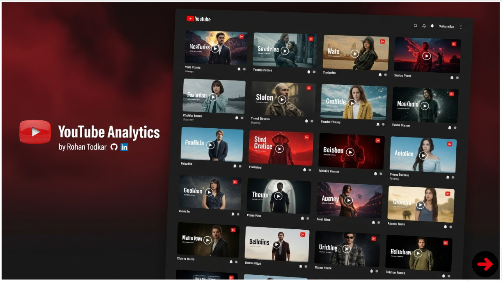
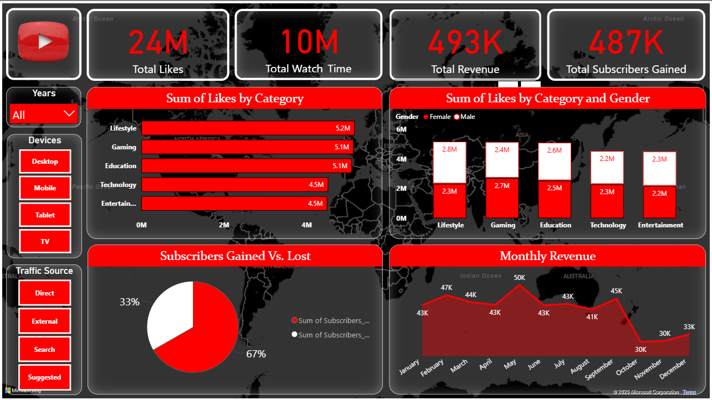
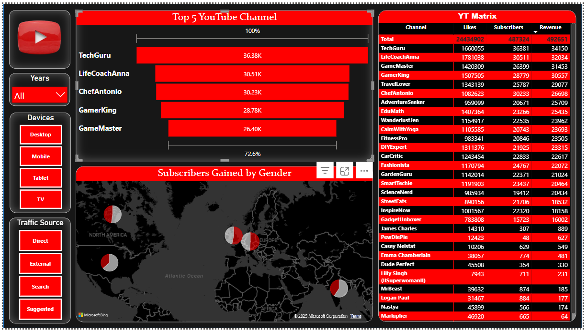
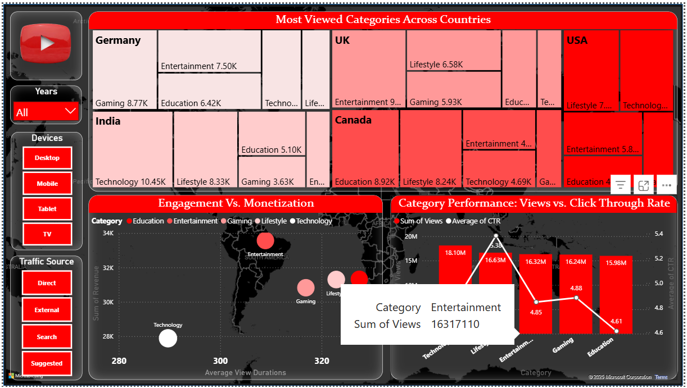

# 📺 YouTube Analytics Dashboard - Power BI Project

> **Created by:** Rohan Todkar  
>  )

---

## 📌 Project Overview

This interactive **Power BI dashboard** simulates a **real-world analytics solution** for a YouTube media business.  
It helps teams **track performance**, **understand audience behavior**, and **make data-driven content decisions** using over 24M interactions and 20+ channels.

> ✅ **Focus**: Not just building dashboards — but solving business problems like:  
> - "Which category generates the most ROI?"  
> - "How are gender and geography influencing engagement?"  
> - "Where are we losing subscribers?"

---

## 🚀 Key KPIs Tracked

- **✅ 24M+ Total Likes**  
- **⏱️ 10M+ Watch Time**  
- **📈 487K Subscribers Gained**  
- **💰 493K Total Revenue**  
- Across **20+ YouTube Channels**, **5 Categories**, and **6 Countries**

---

## 📊 Dashboard Features

| Visual Type | Purpose |
|-------------|---------|
| 📌 **Slicers** (Year, Device, Traffic Source) | Dynamic filtering |
| 📊 **Stacked Bar & Column** | Likes by category & gender |
| 📈 **Area Chart** | Monthly revenue trend |
| 🔄 **Pie Chart** | Subscribers gained vs. lost |
| 🪜 **Funnel Chart** | Top 5 channels |
| 🌍 **Bubble Map** | Subscribers by gender by country |
| 🌲 **Tree Map** | Most viewed categories per country |
| 💹 **Scatter Plot** | Engagement vs. Monetization |
| 📉 **Combo Chart** | Views vs. Click-through rate |
| 🧮 **Matrix Table** | Channel-wise likes, subs, revenue |

---

## 📷 Dashboard Screenshots & Insights

### 🔻 Page 1: Interactive Entry Page

#### 🔍 Insights:
- Clean, modern landing screen with Netflix-like layout using thumbnails.
- Acts as an interactive dashboard **entry point** for users to explore further.
- Strong first impression for non-technical users and stakeholders — **UX/UI driven storytelling**.

---
### 🧠 Page 2: Overview Dashboard

#### 🔍 Insights:
- **24M+ Total Likes**, **10M+ Watch Time**, and **$493K Revenue** show strong platform performance.
- **Lifestyle and Gaming** are the most liked categories.
- **Females engage more with Lifestyle; males with Gaming & Education**.
- **67% subscribers gained vs 33% lost** shows positive retention.
- **Revenue peaks in May ($50K)**; drops after September, indicating seasonal trends.
- Strategic use of slicers for **Years**, **Devices**, and **Traffic Sources** helps segment user behavior easily.

---

### 📈 Page 3: Top Channels & Subscriber Demographics

#### 🔍 Insights:
- **TechGuru** leads in subscribers (36.38K) and revenue ($43K).
- Top 5 channels account for **over 70% of total audience**.
- **Matrix view** gives a detailed comparison of each channel’s likes, subscribers, and revenue — great for benchmarking.
- **Pie charts on the map** show **subscriber gender by region** — e.g., Europe and Asia have stronger male audience shares.

---

### 🌍 Page 4: Global Performance & ROI

#### 🔍 Insights:
- **India and Germany** drive highest views across categories — especially **Tech in India (10.45K views)** and **Gaming in Germany (8.77K views)**.
- **Lifestyle is top in Canada and UK**, while **Entertainment dominates the US**.
- **Scatter plot (Engagement vs. Revenue)** reveals:
  - **Technology** has higher average view duration but moderate revenue.
  - **Entertainment** delivers the best balance of view duration and revenue.
- **CTR vs. Views** analysis shows:
  - **Lifestyle** has high views and highest CTR (5.33%), making it top-performing for marketers.
  - **Education** has the lowest CTR (4.61%) despite good views — needs content strategy review.

---

## 🎯 Business Impact

Rather than focusing on visuals alone, this dashboard was designed to **solve strategic business problems**:

- **Audience Strategy**: Identify top-performing content across countries (e.g., Tech in India).
- **Content Optimization**: Analyze engagement trends across categories and gender.
- **Revenue Intelligence**: Track fluctuations in monthly revenue to plan content budgets.
- **Retention Insights**: Evaluate subscriber gain/loss trends across devices and traffic sources.
- **Marketing Effectiveness**: CTR vs. Views analysis to optimize click-through without misleading users.

---

## 🛠️ Tools & Techniques

- **Power BI Desktop**
- **DAX (Calculated Columns & Measures)**
- **Data Modeling**
- **UX/UI Design (Red-White Theme)**
- **KPI Building**
- **Interactive Visuals & Filters**

---

## 💼 What This Project Shows Recruiters

✅ Strong grasp of **business intelligence principles**  
✅ Ability to **translate business needs into visuals**  
✅ Fluency in **Power BI best practices, data modeling, and DAX**  
✅ Comfort with **storytelling through data**  
✅ Ready to work in a **cross-functional team** involving marketing, content, and revenue teams

> 📣 _"I build dashboards not to show data — but to drive action from it."_  

---

## 📬 Let’s Connect

Feel free to reach out if you’re hiring for a **Data Analyst** or **Business Intelligence** role or want to collaborate!

📧 rohantodkar0705@gmail.com  
🔗 [LinkedIn](https://www.linkedin.com/in/rohantodkar0705/)  
🌐 Portfolio (Coming soon!)
